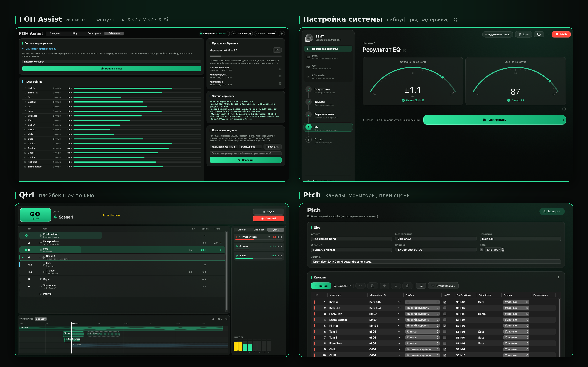
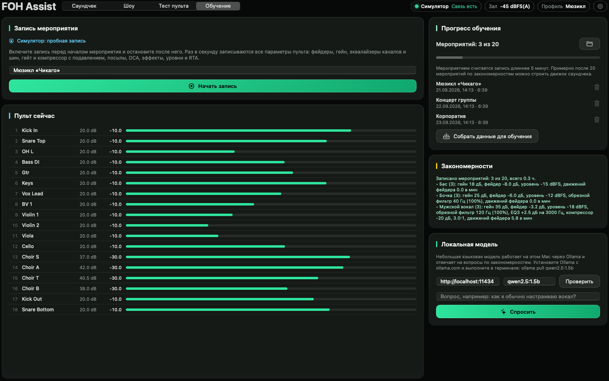
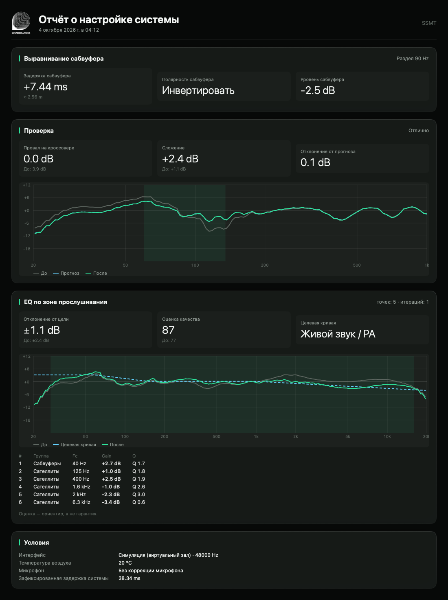
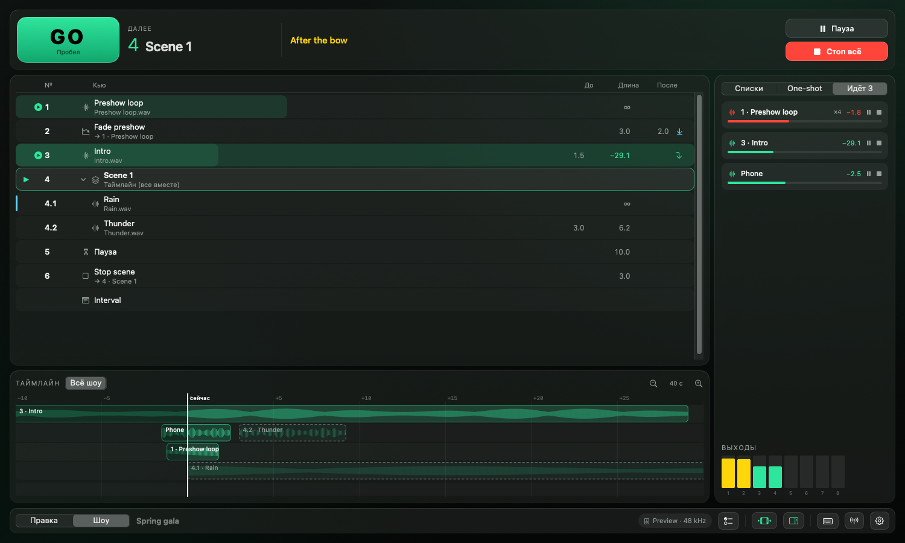
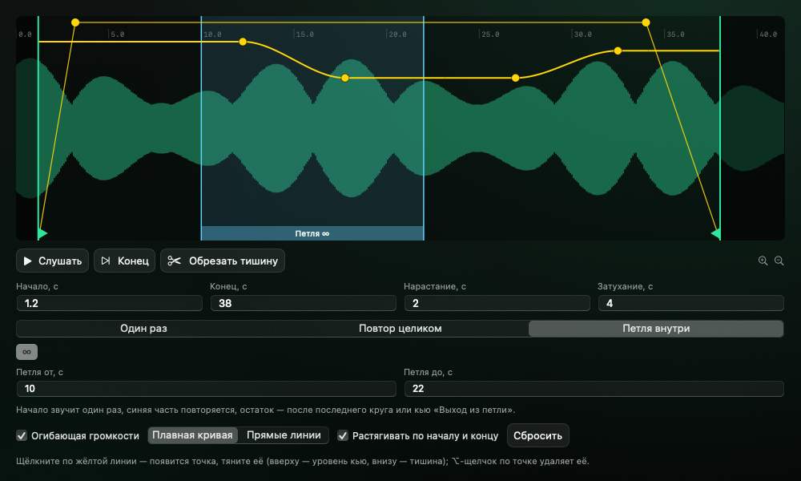
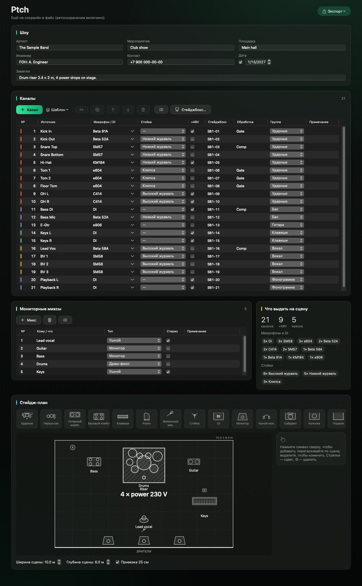

<div align="center">


# SSMT — SoundSolution Multi Tool

**Рабочий инструмент звукорежиссёра и инженера на macOS и Windows**<br>
настройка системы · Ptch · плейбек шоу · обучение FOH Assist

[](../../releases/latest)
[](../../actions/workflows/ci.yml)




</div>

> [!NOTE]
> **FOH Assist сейчас учится.** К настоящему пульту X32 / M32 и X Air / MR он подключается только на чтение и
> ничего на пульте не меняет: записывает, как звукорежиссёр ведёт мероприятие. Автоматический саундчек и страховка
> шоу на настоящем пульте пока закрыты («скоро будет доступно») и появятся после обучения. Попробовать их можно
> в симуляторе.

## 📥 Скачать

| Что | Для кого | Где |
|---|---|---|
| **SSMT для Mac** (установщик `.pkg`) | macOS 13+, Apple Silicon и Intel | [**Последний релиз**](../../releases/latest) |
| **SSMT для Windows** | Windows 10 / 11, 64 бит | Готовится: полная версия, такая же, как на Mac |
| Руководство | Как пользоваться всеми функциями | [Русский](docs/USER_GUIDE.ru.md) · [English](docs/USER_GUIDE.en.md) |
| Установка | Первый запуск без подписи Apple Developer ID | [docs/INSTALL.md](docs/INSTALL.md) |

## 🎚️ Зачем

Каждый выезд начинается с одного и того же: согласовать сабвуферы с основными акустическими системами, найти задержку, поправить EQ, собрать
input list и план сцены, подготовить фонограммы, провести саундчек по каждому каналу — а потом весь концерт
следить, чтобы не возникла акустическая обратная связь в основной и мониторной системах. Часы рутины, разными программами, каждый раз заново.

**SSMT собирает эту рутину в одно окно: измеряет, считает и подсказывает. Решения и микс остаются за
звукорежиссёром.**

## ✨ Что умеет

- 📐 **Настройка системы** — пошаговый мастер: двухканальный FFT, задержка и полярность, согласование сабвуферов с
  основными акустическими системами, EQ на стандартных частотах процессора, проверка после ввода и отчёт в PDF. Калибровочные файлы
  измерительных микрофонов и типовые профили.
- 📋 **Ptch — каналы и план сцены** — каналы из шаблонов, мониторные миксы, сводка «что выдать на сцену»
  (микрофоны, DI, стойки, +48 V), план сцены. PDF, PNG, CSV — готовый райдер для площадки.
- ▶️ **Qtrl — Show Control Center** — воспроизведение фонограмм по списку команд: старт с точностью до сэмпла, плавные изменения уровня, группы, паузы,
  OSC для света, видео и пультов (Resolume, ETC Eos, grandMA3, MagicQ, X32/M32), кнопки one-shot,
  временная шкала, «Стоп всё» и защита от двойного GO.
- 🤖 **FOH Assist** *(обучение)* — подключается к X32 / M32 и X Air по Wi-Fi только на чтение:
  - 📝 **запись мероприятий** — раз в секунду сохраняет фейдеры, гейн, эквалайзер, динамику и уровни каналов;
  - 📈 **закономерности** — после записей (цель около 20 мероприятий) показывает, как вы обычно настраиваете каждый тип источника;
  - 💬 **локальная модель** — небольшая языковая модель на этом компьютере отвечает на вопросы о ваших закономерностях;
  - 🧪 **симулятор** — черновые функции саундчека и страховки шоу можно посмотреть на виртуальном пульте.
    На настоящем пульте они появятся после обучения.

<details open>
<summary>📸 Скриншоты</summary>

| 🤖 FOH Assist — обучение | 📐 Настройка системы — EQ |
|---|---|
|  |  |
| **📄 Отчёт о настройке** | **▶️ Qtrl — шоу и таймлайн** |
|  |  |
| **▶️ Qtrl — трек: петля, огибающая громкости** | **📋 Ptch — каналы и план сцены** |
|  |  |

</details>

## 💡 Почему это решение

| | |
|---|---|
| ⏱️ **Быстрее** | Настройка системы — шаги «измерить → проверить → готово» вместо часов вручную. |
| 🔁 **Повторяемо** | Измерения, а не «на слух в шуме зала»: результат проверяется, сохраняется в отчёт и повторяется на следующей площадке. |
| 🛟 **Безопасно** | На настоящем пульте FOH Assist только читает и ничего не меняет. |
| 🧰 **Одно окно** | Измерения, райдер, плейбек и связь с пультом — без переключения между пятью программами. |
| 🎓 **Без оборудования** | Виртуальный зал и виртуальный пульт — научиться и проверить всё до выезда. |

## 🚀 Быстрый старт

1. Скачайте `SSMT-<версия>.pkg` (Mac) или `SSMT-Setup-<версия>.exe` (Windows) со страницы [Releases](../../releases/latest) и откройте его.
2. На Mac macOS предупредит о неподтверждённом разработчике (бесплатная программа без подписи Apple Developer ID):
   **Системные настройки → Конфиденциальность и безопасность → «Всё равно открыть»**.
3. При первом запуске разрешите доступ к микрофону.
4. Выберите функцию в боковой панели: **Настройка системы**, **Ptch**, **Qtrl** или **FOH Assist**.

> [!TIP]
> Нет оборудования под рукой? В настройке системы выберите **«Симуляция (виртуальный зал)»**, а в FOH Assist —
> **«Симулятор (без пульта)»**: все функции можно попробовать без звуковой карты и пульта.

## 📚 Документация

- [Руководство пользователя (RU)](docs/USER_GUIDE.ru.md) · [User guide (EN)](docs/USER_GUIDE.en.md)
- [Установка](docs/INSTALL.md) · [Что нового](docs/RELEASE_NOTES.md) · [История версий](docs/CHANGELOG.md)
- [Статус функций](docs/STATUS.md) · [Принятые решения и допущения](docs/ASSUMPTIONS.md)

---

<details>
<summary>🇬🇧 English</summary>

**SSMT is a workstation tool for live sound engineers and system techs on macOS and Windows: system alignment,
input lists, show playback and a learning console assistant in one app.**

- 📐 **System setup** — guided sub ↔ mains alignment from dual-channel FFT measurements, delay and polarity,
  EQ suggestions on standard processor frequencies, verification and a PDF report; measurement-mic calibration.
- 📋 **Ptch — channels, monitors, stage plan** — channels from templates, monitor mixes, a pull list, a stage plot; PDF / PNG / CSV.
- ▶️ **Qtrl — Show Control Center** — cue-based playback with sample-accurate starts, fades, groups, OSC to
  lighting, video and consoles, one-shot pads, a timeline, two-stage Stop all.
- 🤖 **FOH Assist** *(learning)* — connects to Behringer X32 / Midas M32 and X Air over Wi-Fi read-only and
  records how the engineer runs an event, once a second; finds per-source patterns over about 20 events and lets a
  small local model answer questions about them. Automatic soundcheck and the show guard are closed on a real
  console until the learning is done; they can be tried in the simulator. The Windows version is in progress: the full program, identical to the Mac one.

Why: hours of routine on every gig become a few measured, repeatable steps, while the mix stays in the
engineer's hands. Requires macOS 13+ (Apple Silicon or Intel) or Windows 10 / 11 (64-bit). [Download](../../releases/latest) ·
[User guide](docs/USER_GUIDE.en.md) · [Install](docs/INSTALL.md)

</details>

<details>
<summary>🛠️ Для разработчиков</summary>

| Path | What |
|---|---|
| `Packages/SSMTCore` | DSP, measurement engine, FOH Assist logic, simulation (no UI, no Core Audio). Tested on macOS and Linux. |
| `Packages/SSMTCore/Sources/SSMTRealtime` | C11 lock-free ring buffer and atomics for the audio thread |
| `Packages/SSMTAudio` | Core Audio HAL (AUHAL) duplex backend, device catalog |
| `App/SSMT` | SwiftUI app |
| `Windows/Engine`, `Windows/App` | Windows: SSMTCore as `ssmt-engine.exe` under an Electron interface |
| `project.yml` | XcodeGen project spec |

```sh
brew install xcodegen      # free, build-time only
xcodegen generate
open SSMT.xcodeproj         # or: xcodebuild -scheme SSMT -configuration Release build
```

- Core tests: `swift test -c release --package-path Packages/SSMTCore`
  (Linux without a toolchain: `scripts/linux-swift.sh swift test -c release --package-path Packages/SSMTCore`).
- Snapshot tests (macOS): `xcodebuild test -scheme SSMT -configuration Debug -destination 'platform=macOS'`;
  references in `App/Tests/Snapshots/References` (CI records missing ones).
- Release: push a tag `vX.Y.Z` or run the CI workflow with `release_tag` → CI builds, ad-hoc signs, packages
  `SSMT-X.Y.Z.pkg` and `SSMT-Setup-X.Y.Z.exe` and publishes a GitHub Release.
- UI strings: `scripts/strings.py` (en + ru). Plan: [docs/PLAN.md](docs/PLAN.md) · Acceptance: [docs/ACCEPTANCE.md](docs/ACCEPTANCE.md)

</details>
